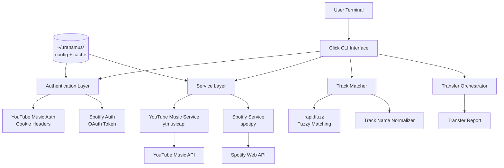
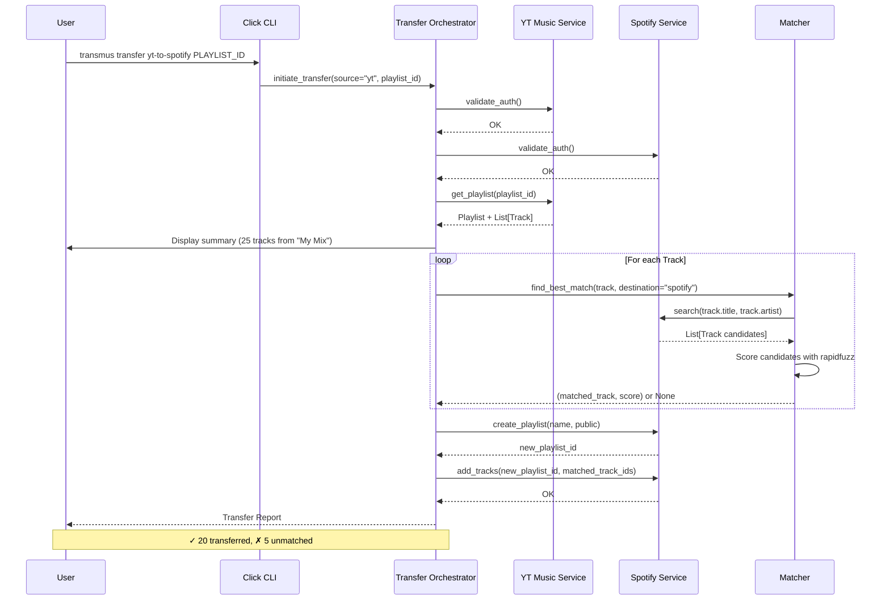

# Transmus - Architecture & Implementation Plan

## Overview

**Transmus** is a Python CLI tool that transfers music playlists between **YouTube Music** and **Spotify** (bidirectional). Users run it from their terminal — no servers, no cloud costs, completely free.

---

## Tech Stack

| Component          | Choice                     | Rationale                                      |
|--------------------|----------------------------|-------------------------------------------------|
| Language           | Python 3.10+               | Rich ecosystem, great API libraries             |
| CLI Framework      | `click`                    | Mature, well-documented, extensible             |
| YT Music Library   | `ytmusicapi`               | Mature unofficial lib, cookie-based auth        |
| Spotify Library    | `spotipy`                  | Official Spotify Web API wrapper                |
| Config Storage     | JSON in `~/.transmus/`     | Simple, portable, human-readable                |
| Fuzzy Matching     | `rapidfuzz`                | Fast, no GPL restrictions (unlike fuzzywuzzy)   |
| HTTP Client        | `httpx` (via ytmusicapi)   | Async-capable, modern                           |
| Testing            | `pytest`                   | Standard Python testing                         |

---

## Authentication Strategy

### YouTube Music (Cookie-Based)

`ytmusicapi` requires browser authentication headers. No official OAuth exists.

**User flow:**
1. User runs `transmus auth youtube`
2. CLI provides step-by-step instructions to copy the Cookie from browser DevTools (F12 → Network tab → copy Cookie header)
3. The Cookie is parsed to extract the SAPISID value, which is used to compute the `Authorization` header (SAPISID hash)
4. Headers are validated and saved to `~/.transmus/youtube_headers.json`
5. A fallback JSON file method is available for advanced users

**Storage:** `~/.transmus/youtube_headers.json` (sensitive — marked in `.gitignore`)

### Spotify (OAuth)

Uses Spotify's Authorization Code flow via `spotipy`.

**Prerequisite:** User must create a free Spotify App at [developer.spotify.com/dashboard](https://developer.spotify.com/dashboard) to get `CLIENT_ID` and `CLIENT_SECRET`.

**User flow:**
1. User runs `transmus auth spotify`
2. CLI prompts for `client_id` and `client_secret` (or reads from env vars)
3. Browser opens for user to authorize
4. Token cached locally; refresh handled automatically

**Storage:** `~/.transmus/spotify_cache` (auto-managed by spotipy)

---

## Project Structure

```
c:/Users/Raj/Documents/Transmus/
├── README.md                     # Project overview, setup, usage
├── LICENSE                       # MIT License
├── pyproject.toml                # Project metadata, dependencies
├── requirements.txt              # Pinned dependencies
├── setup.py                      # Installable package config
├── .gitignore                    # Python + secrets + OS ignores
├── CHANGELOG.md                  # Version history
├── CONTRIBUTING.md               # Contribution guidelines
│
├── transmus/                     # Main package
│   ├── __init__.py               # Version, exports
│   ├── __main__.py               # python -m transmus support
│   ├── cli.py                    # Click CLI entry point, command groups
│   ├── config.py                 # Config file management (read/write ~/.transmus/)
│   ├── models.py                 # Pydantic/dataclass models (Playlist, Track, etc.)
│   │
│   ├── auth/                     # Authentication modules
│   │   ├── __init__.py
│   │   ├── youtube_auth.py       # YT Music cookie setup & validation
│   │   └── spotify_auth.py       # Spotify OAuth flow via spotipy
│   │
│   ├── services/                 # API interaction layer
│   │   ├── __init__.py
│   │   ├── youtube_music.py      # YTMusic API wrapper (list/read/create playlists)
│   │   └── spotify_service.py    # Spotify API wrapper (list/read/create playlists)
│   │
│   ├── matcher.py                # Track matching: search destination, score results
│   └── transfer.py               # Transfer orchestration (source → matcher → create)
│
├── tests/                        # Test suite
│   ├── __init__.py
│   ├── conftest.py               # Fixtures, mock data
│   ├── test_youtube_music.py     # YT Music service tests
│   ├── test_spotify_service.py   # Spotify service tests
│   ├── test_matcher.py           # Matching logic tests
│   ├── test_cli.py               # CLI command tests
│   └── fixtures/                 # Sample data for tests
│       ├── youtube_playlist.json
│       └── spotify_playlist.json
│
├── docs/                         # Additional documentation
│   ├── setup.md                  # Detailed setup guide
│   └── troubleshooting.md        # Common issues & solutions
│
├── plans/                        # Planning documents (this file)
│   └── architecture.md
│
└── .github/                      # GitHub-specific files
    ├── ISSUE_TEMPLATE/
    │   ├── bug_report.md
    │   └── feature_request.md
    └── workflows/
        ├── tests.yml             # Run tests on push/PR
        └── lint.yml              # Lint with ruff
```

---

## CLI Command Tree

```
transmus
├── auth
│   ├── youtube          # Setup YT Music auth (cookie-based)
│   └── spotify          # Setup Spotify OAuth
│
├── status               # Check auth status for both services
│
├── yt
│   ├── playlists        # List your YouTube Music playlists
│   └── playlist <id>    # View tracks in a specific playlist
│
├── spotify
│   ├── playlists        # List your Spotify playlists
│   └── playlist <id>    # View tracks in a specific playlist
│
├── transfer
│   ├── yt-to-spotify <yt_playlist_id> [--name "New Name"] [--public]
│   │   # Transfer YT Music playlist → Spotify
│   │
│   └── spotify-to-yt <spotify_playlist_id> [--name "New Name"] [--public]
│       # Transfer Spotify playlist → YouTube Music
│
└── --help, --version
```

---

## Core Data Models

```python
@dataclass
class Track:
    title: str
    artist: str
    album: str | None
    duration_ms: int | None
    source_id: str | None         # ID in the source platform
    source_uri: str | None        # URI in the source platform

@dataclass
class Playlist:
    id: str
    name: str
    description: str | None
    owner: str | None
    track_count: int
    url: str | None
    tracks: list[Track]
```

---

## Transfer Flow (Detailed)

### YT Music → Spotify

```
1. Validate auth (both sides)
2. Fetch playlist metadata + tracks from YT Music
3. Display summary: "Transferring 25 tracks from 'My Mix' to Spotify"
4. For each track in YT Music playlist:
   a. Search Spotify for: track title + artist
   b. Score results using rapidfuzz (title 60% weight + artist 40% weight)
   c. If best score >= 75: select match
   d. If best score < 75: mark as unmatched, log reason
5. Create new Spotify playlist with specified name
6. Add matched tracks in batches of 100 (Spotify API limit)
7. Print transfer report:
   ✓ 20 tracks transferred
   ✗ 5 tracks not found (listed with details)
```

### Spotify → YT Music

```
1. Validate auth (both sides)
2. Fetch playlist metadata + tracks from Spotify
3. Display summary
4. For each track:
   a. Search YT Music using ytmusicapi.search_songs()
   b. Pick best match by title+artist similarity score
   c. Handle similarly
5. Create new YT Music playlist
6. Add matched tracks via ytmusicapi.add_playlist_items()
7. Print transfer report
```

---

## Track Matching Algorithm

```
Input: source_track (title, artist)

1. Normalize both title and artist:
   - Lowercase
   - Strip punctuation
   - Remove "feat.", "ft.", "featuring" variations
   - Remove "(Remastered)", "(Live)", etc. parenthetical tags

2. Search destination API with normalized title + artist

3. For each result, compute composite score:
   title_similarity = rapidfuzz.fuzz.token_sort_ratio(source.title, result.title)
   artist_similarity = rapidfuzz.fuzz.token_sort_ratio(source.artist, result.artist)
   composite_score = (title_similarity * 0.6) + (artist_similarity * 0.4)

4. Select best match if composite_score >= THRESHOLD (75/100)

5. Return: (matched_track, score) or None
```

---

## Configuration Management (`~/.transmus/`)

```
~/.transmus/
├── config.json                 # General settings
│   {
│     "default_playlist_visibility": "public",
│     "spotify_client_id": "...",
│     "spotify_client_secret": "..." (encrypted or env-only),
│     "created_at": "2026-05-11T...",
│     "version": "1.0.0"
│   }
│
├── youtube_headers.json         # YT Music browser headers (sensitive)
│
└── spotify_cache/               # spotipy token cache directory
    └── .cache
```

---

## Error Handling Strategy

| Scenario                    | Handling                                               |
|-----------------------------|--------------------------------------------------------|
| Network error               | Retry up to 3x with exponential backoff (1s, 4s, 9s)  |
| Auth expired/invalid        | Clear token, prompt user to re-authenticate            |
| Spotify rate limit (429)    | Wait `Retry-After` header seconds, then retry          |
| YT Music rate limit         | 5s cooldown between requests (configurable)            |
| Track not found             | Log, skip, include in final report                    |
| Partial batch failure       | Retry failed items individually, report at end         |

---

## Testing Strategy

- **Unit tests**: Service layer mocked responses, matcher logic with known inputs/outputs
- **Integration tests**: Optional (marked with `@pytest.mark.integration`) — require real credentials
- **CLI tests**: Use `click.testing.CliRunner` to simulate CLI invocations
- **Fixtures**: Pre-recorded API responses in `tests/fixtures/`

---

## GitHub Repository Setup

- **Visibility**: Public
- **License**: MIT
- **Topics**: `youtube-music`, `spotify`, `playlist-transfer`, `music`, `cli`, `python`
- **Branch protection**: Main branch protected, require PR review
- **CI**: GitHub Actions
  - `tests.yml`: Python 3.10/3.11/3.12, `pytest` on push & PR
  - `lint.yml`: `ruff` linting & formatting check

---

## Dependencies (requirements.txt)

```
click>=8.1
ytmusicapi>=1.8
spotipy>=2.24
rapidfuzz>=3.9
pydantic>=2.0
httpx>=0.27
```

**Dev dependencies:**
```
pytest>=8.0
pytest-cov>=5.0
ruff>=0.5
mypy>=1.10
```

---

## Implementation Order

| Step | Description                                    | Files                                              |
|------|------------------------------------------------|----------------------------------------------------|
| 1    | Project scaffolding, config, models            | pyproject.toml, setup.py, .gitignore, config.py, models.py |
| 2    | YouTube Music service (list, search, create)   | youtube_music.py, youtube_auth.py                  |
| 3    | Spotify service (list, search, create)         | spotify_service.py, spotify_auth.py                |
| 4    | Track matcher with fuzzy scoring               | matcher.py                                         |
| 5    | Transfer orchestrator                          | transfer.py                                        |
| 6    | CLI binding with click                         | cli.py, __init__.py, __main__.py                   |
| 7    | README, LICENSE, CONTRIBUTING, CHANGELOG       | README.md, LICENSE, CONTRIBUTING.md, CHANGELOG.md  |
| 8    | Tests                                          | tests/ directory                                   |
| 9    | GitHub CI workflows                            | .github/workflows/                                 |
| 10   | GitHub publish + tag release                   | git init, commit, push, tag                        |

---

## Mermaid: High-Level Architecture



## Mermaid: Transfer Flow (YT Music → Spotify)



---

## Security Considerations

1. **YouTube headers** are sensitive (contain cookies) — clearly documented and in `.gitignore`
2. **Spotify credentials** — users are advised to:
   - Use environment variables (`SPOTIFY_CLIENT_ID`, `SPOTIFY_CLIENT_SECRET`)
   - Never commit credentials to GitHub
3. **Token storage** — stored in user's home directory (`~/.transmus/`), not in project folder
4. **No data collection** — tool operates entirely locally, no telemetry
